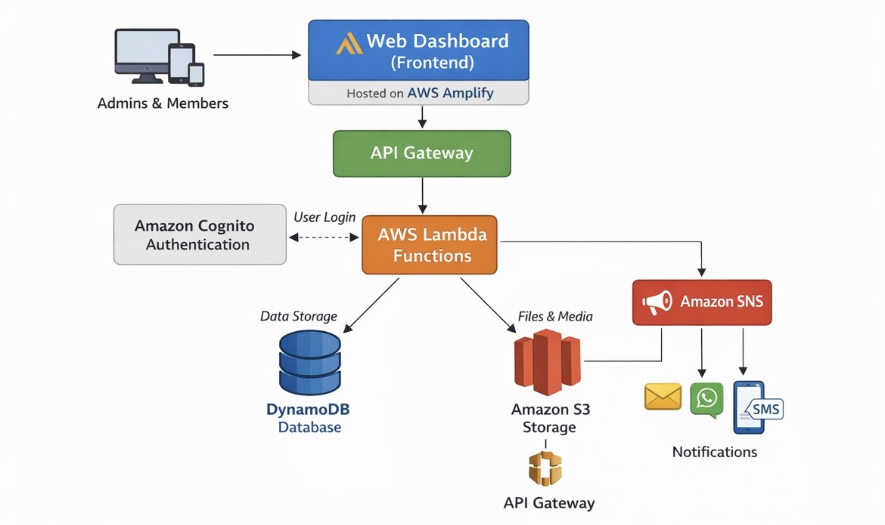

#FaithHive OS – Church Management System

Day 1/100 Days of Cloud — Setting Up the Foundation

Today, I focused on **setting up the project environment** and creating the first version of the system.

### What I did:

1. **Installed Node.js**  
   Node.js is a platform that allows me to run JavaScript programs on my computer.

2. **Set up VS Code**  
   VS Code is the editor where I write and organize all project files.

3. **Created the first program**  
   I wrote a simple JavaScript file that prints a message to confirm Node.js is working.

4. **Connected the project to GitHub**  
   GitHub is an online platform that stores my project, tracks changes, and lets me share my work with the world.

### Why this matters

By completing these steps, I now have a **working foundation** for FaithHive OS. This foundation will allow me to:

- Add church members and visitors
- Track their information automatically
- Prepare for cloud integration on AWS
- Expand to more features like financial tracking, announcements, and dashboards

Day 2 of #100DaysOfCloud

##FaithHive OS is a cloud-ready system designed to help churches manage members, visitors, and financial data efficiently. This project is part of my 100-day learning journey into cloud computing, Node.js, and GitHub.

##What I Did Today (Day 2)
1️⃣ Creating Members and Visitors Lists

I set up arrays (lists) in Node.js to store:

-Name

-Phone number

-Preferred contact method (WhatsApp or SMS)

-Date joined / visit date

##These lists are the foundation of the system, allowing us to store all member and visitor data in one place.

#Note: I plan to add email addresses and birthdays later for automated messages and greetings.

let members = [];
let visitors = [];

let memberList = [
  { name: "Rev. Charles Asare", phone: "+233243080947", dateJoined: "2020-03-19", contactMethod: "WhatsApp" },
  { name: "Mrs. Dorothy Asare", phone: "+233532335703", dateJoined: "2020-03-19", contactMethod: "SMS" },
];

let visitorList = [
  { name: "Agnes Lartey", phone: "+233242045327", visitDate: "2026-03-16", contactMethod: "WhatsApp" },
];

2️⃣ Automating Member & Visitor Addition

Instead of adding each member one by one, I wrote functions to automatically add all members and visitors from the lists:

function addMember(name, phone, dateJoined) {
  members.push({ name, phone, dateJoined });
}

function addVisitor(name, phone, visitDate) {
  visitors.push({ name, phone, visitDate });
}

// Loop through lists
for (let person of memberList) addMember(person.name, person.phone, person.dateJoined);
for (let person of visitorList) addVisitor(person.name, person.phone, person.visitDate);

Why:
This makes the system more efficient and scalable, so it can handle growing numbers of members and visitors without manual work.

3️⃣ Checking That It Works

I ran the program in Node.js to verify that all data is correctly stored:

node members.js

Output in the console shows all members and visitors:

Members: [
  { name: 'Rev. Charles Asare', phone: '+233243080947', dateJoined: '2020-03-19' },
  { name: 'Mrs. Dorothy Asare', phone: '+233532335703', dateJoined: '2020-03-19' }
]
Visitors: [
  { name: 'Agnes Lartey', phone: '+233242045327', visitDate: '2026-03-16' }
]

Next Steps

1.Connect FaithHive OS to AWS Cloud for remote access and scalability

2.Add financial tracking: tithe and contributions management

3.Implement dashboards, automated notifications, and announcements

## Day 3 – System Architecture

Today, I designed the architecture of FaithHive OS.

FaithHive OS is built using a serverless architecture on AWS to ensure scalability, reliability, and cost efficiency.

### Architecture Overview

### How the System Works

1. Users (Admins & Members) access the system through a web dashboard.
2. The frontend is hosted using AWS Amplify.
3. API Gateway handles incoming requests from the frontend.
4. AWS Lambda processes the requests and runs backend logic.
5. DynamoDB stores structured data like members, visitors, and financial records.
6. Amazon S3 stores files such as devotional media and reports.
7. Amazon Cognito manages authentication and secure login.
8. Amazon SNS sends notifications such as announcements and birthday messages.

### Why This Architecture?

- Serverless (no server management)
- Scalable (grows with church size)
- Cost-efficient (pay only when used)
- Secure (authentication with Cognito)

